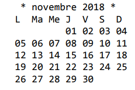

La Programmation Orientée Objet (POO) avec JAVA   
*******************************************
Exercice réalisé dans le cadre de ma formation Développeur Web/Web mobile avec ENI Ecole Informatique  
Janvier 2021  
*******************************************
L'utilisation de classes de JAVA  
TP Calendrier   
Durée estimée : 1 heure 30   
IDE : Eclipse  
*******************************************
__Énoncé de l'exercice__

L’objectif est de créer un petit calendrier permettant de visualiser tous les jours d’un mois
d’un seul coup d’œil.  

__Indications__  

1 - Création du projet :
Garder les options par défaut, notamment la séparation des fichiers sources et des
fichiers compilés.  

2 - Création d’une procédure afficherMois() prenant en paramètres deux entiers : l’année et le mois à afficher.  
Le numéro du mois est basé à partir de zéro, c’est-à-dire que le mois de janvier correspond à 0 et décembre à 11.   
L’affichage attendu pour un appel à cette méthode avec les valeurs 2018 et 10 doit être celui-ci :  

  

Pour écrire cette procédure, il est nécessaire de se référer à la Javadoc de la classe
GregorianCalendar.
